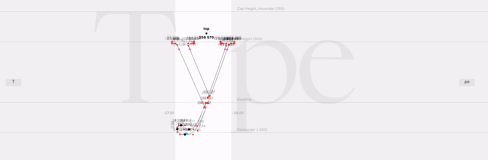
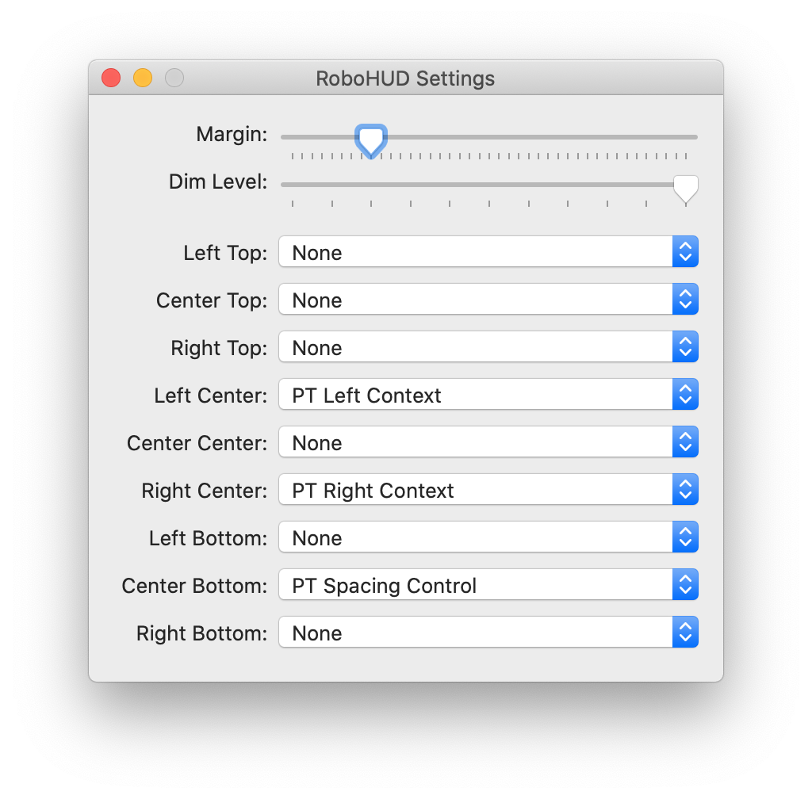

# Robofont left and right context

The extension this repo add context to your glyph window using [RoboHUD](https://github.com/typesupply/robohud) from Tal Leming.

So far, you can add:

* ptHUDleftContext
* ptHUDrightContext

## 🛠 Install
1. Install RoboHUD.  
	You can find it [there](https://github.com/typesupply/robohud) or in `_source/build/RoboHUD.roboFontExt`.
2. Install whichever functionalities from the one previously listed by installing the extension file located in the `build` folder from relevant folder.
3. In Robofont, go to Extension > RoboHUD > Edit Settings…
4. From the settings window, select in which slot you want your function to be placed.  

5. Now you can use it.

## ❌ Limitations
### ptHUDleftContext / ptHUDrightContext
* When switching from a font to another, erase the input text.
* No settings for color and strokes
* No auto context

## 🚗 Roadmap
* Fix all limitations listed above.

If you have suggestions, please let us know!

## 👏 Credits
Those functions wouldn’t have bee possible without [RoboHUD](https://github.com/typesupply/robohud) from Tal Leming.

ptHUDleftContext and ptHUDrightContext rely heavily on [RamsaySt](https://github.com/typemytype/ramsayStreetRoboFontExtension) from Frederik Berlaen.
